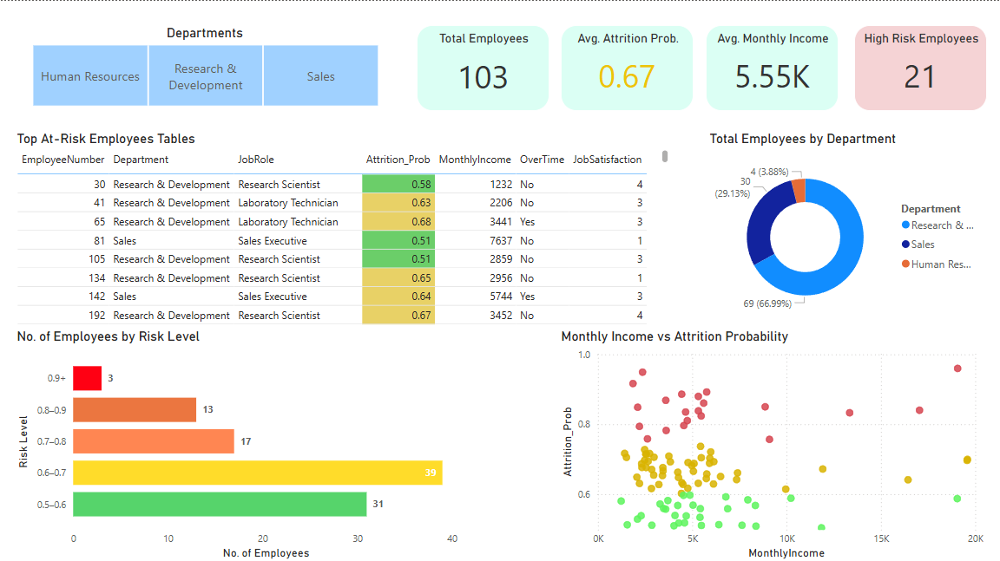

# 🧠 Employee Attrition Analysis & Prediction

This project aims to help HR professionals **predict and reduce employee attrition** using data-driven insights and machine learning models.

---

## 🔍 Project Overview

- Analyzed HR data to identify key drivers of attrition
- Built and compared classification models (Logistic Regression & Decision Tree)
- Predicted probability of attrition for each employee
- Exported a list of **high-risk employees** (`Attrition_Prob > 0.5`)
- Built an interactive dashboard to help HR understand who’s at risk and why

---

## 🧪 Technologies Used

- **Python**: pandas, matplotlib, seaborn, scikit-learn  
- **Jupyter Notebook**: EDA, modeling, exporting data  
- **Power BI**: Dashboard and interactive filtering  
- **CSV**: Input and output datasets

---

## 📊 Dashboard Features

Built using **Power BI** to help HR teams make informed decisions:

| Section | Description |
|--------|-------------|
| ✅ KPIs | Total at-risk employees, average attrition probability, avg. income |
| 📈 Charts | No. of Employees By Risk Level |
| 📍 Scatter Plot | MonthlyIncome vs Attrition_Prob |
| 📌 Filters | Department |
| 🔴 Table | Top high-risk employees |

---
## Screenshot

---
---
## 📁 Files in this Repo

| File | Description |
|------|-------------|
| `attrition_analysis.ipynb` | Full analysis, modeling, and predictions |
| `at_risk_employees.csv` | Output: Employees with Attrition_Prob > 0.5 |
| `ibm_employee_dataset.csv` | Main IBM employee dataset used for analysis |
| `Dashboard.pbix` | Power BI dashboard file |
| `dashboard_screenshot.png`| Screenshot of the Dashboard |
| `README.md` | Project documentation |

---

## 📌 Key Takeaways

- Salary is not the only factor—OverTime and JobSatisfaction play critical roles  
- Some high-income employees still showed high attrition risk  
- Actionable recommendations (e.g., reduce workload, improve satisfaction)

---

## 📬 Contact

Made with 💼 by Adnan Rahmanpoor 
[LinkedIn](https://linkedin.com/in/adnanrahmanpoor) | [Email](adnanrahmanpoor@gmail.com) | [Portfolio](https:/github.com/adnanrahmanpoor/Data_Projects)

