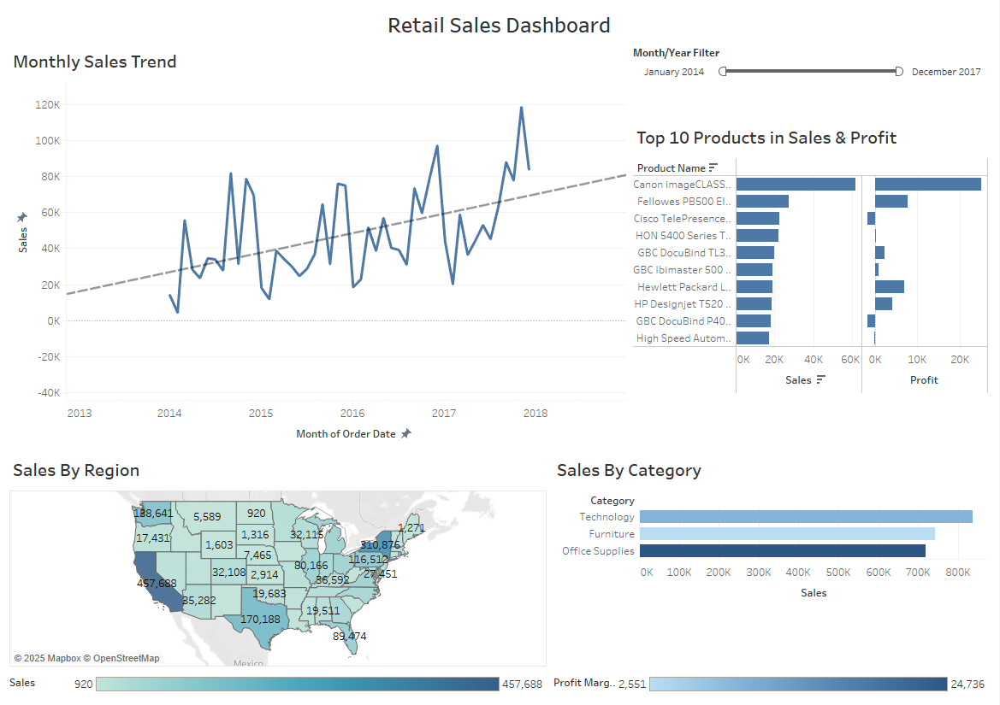

# Retail Sales Data Analysis Project

## Overview
This repository contains a comprehensive retail sales analysis project using Excel and Tableau. The project analyzes the Superstore Sales dataset to identify key sales trends, product performance, regional insights, and customer behavior patterns to drive data-informed business decisions.

## Table of Contents
- [Project Structure](#project-structure)
- [Screenshot](#screenshot)
- [Dataset Description](#dataset-description)
- [Analysis Methodology](#analysis-methodology)
- [How to Use This Repository](#how-to-use-this-repository)
- [Requirements](#requirements)
- [Installation Guide](#installation-guide)

## Project Structure
```
retail-sales-analysis/
├── data/
│   ├── raw/
│   │   └── Superstore_raw_dataset.csv
│   └── processed/
│       └── Superstore-dataset_cleaned.csv
├── xlsx/
|    └── retail_sales_analysis.xlsx
|
├── tableau/
│   ├── RetailSalesDashboard.twb
│   └── tableau_workbook_screenshots/
|     └── dashboard_screen.png
├── reports/
│   ├── executive_summary.pdf
│   └── detailed_analysis.pdf
└── README.md
```

## Screenshot



## Dataset Description
The analysis uses the Superstore Sales dataset.

- Source: [Superstore Dataset | Kaggle](https://www.kaggle.com/datasets/vivek468/superstore-dataset-final)

## Analysis Methodology

### Data Preparation
1. **Data Cleaning**
   - Checked and handled missing values
   - Removed duplicates
   - Corrected data types
   - Created additional helper columns (Month-Year, Quarter, Profit Margin)

2. **Excel Analysis**
   - Created summary statistics
   - Developed pivot tables for key metrics
   - Generated initial visualizations

3. **Tableau Visualization**
   - Built interactive dashboard with 4 main components:
     - Monthly Sales Trend
     - Sales by Category
     - Geographic Sales Map
     - Top Products Table

<!-- ## Key Findings -->
<!-- - Monthly sales demonstrate a seasonal pattern with peaks during [specific months]
- [Category name] represents the highest-selling product category
- The [region name] region shows the strongest sales performance
- Customer segment analysis reveals [key segment insight]
- Discount analysis shows [impact of discounts on profit margins] -->


## How to Use This Repository

### Excel Analysis
1. Open `retail_sales_analysis.xlsx` in Microsoft Excel
2. Navigate through the worksheets:
   - Sheet 1: Raw Data
   - Sheet 2: Cleaned Data
   - Sheet 3: Summary Statistics
   - Sheets 4-7: Various Pivot Tables + Viz

### Tableau Dashboard
1. Open `RetailSalesDashboard.twb` in Tableau Desktop or Tableau Reader
2. Interact with the visualizations using the filters
3. Hover over data points for tooltips with additional information
4. Use the dashboard actions to explore relationships between visualizations

## Requirements
- Microsoft Excel (2016 or newer recommended)
- Tableau Desktop or Tableau Public (2021.4 or newer)
- Alternatively, Tableau Reader can be used to view the dashboard

## Installation Guide

### Excel
1. Download the repository
2. Open the Excel file directly - no additional installation required

### Tableau
1. Download and install [Tableau Public](https://public.tableau.com/en-us/s/download) (free)
2. Open the `.twb` file in Tableau Public
<!-- 3. Alternatively, view the published dashboard at [Tableau Public Link - replace with your actual link] -->
