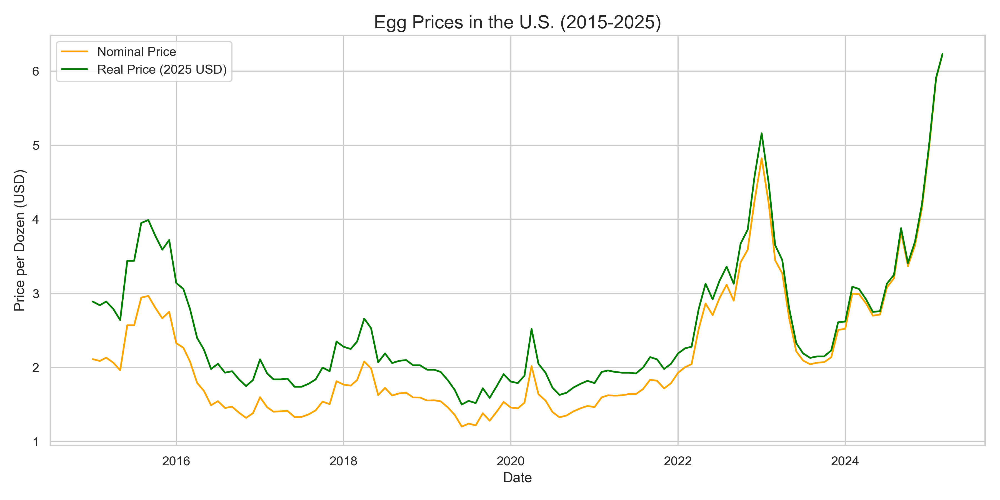

# 🥚📈 Egg Price Analysis (2015–2025)

This project investigates the dramatic rise in U.S. egg prices between 2015 and 2025, comparing actual price trends with inflation-adjusted baselines using the Consumer Price Index (CPI). The goal is to uncover whether inflation alone explains the price spike—or if egg-specific market forces played a major role.

---

## 🔍 Project Highlights

- **📊 Comparative Time Series Analysis:**  
  Plots actual egg prices vs. CPI-adjusted prices from 2015 to 2025.

- **🧠 Key Insight:**  
  Post-2022, egg prices soared far beyond inflation expectations, hinting at external shocks (avian flu, supply chain issues) rather than general inflation.

- **🧵 Bonus:**  
  Viral Twitter-style thread and chart created to make data insights more accessible.

---

## 🗂️ Folder Structure

```
egg_price_analysis_usa_2015_2025/
├── data/ 
|   ├── egg_prices.csv # Historical egg price data (nominal) 
|   └── CPI-march2025.xlsx # Monthly CPI data for inflation adjustment 
├── egg_price_analysis.ipynb # Jupyter Notebook with full analysis 
├── egg_prices_real_adjusted.csv # Cleaned & inflation-adjusted dataset 
└── egg_price_analysis.png # Final visual comparing actual vs adjusted prices
```

---

## 🧪 Technologies Used

- **Python (Pandas, Matplotlib, Seaborn)**
- **Jupyter Notebook**
- **Excel (for CPI source data)**
- **Twitter/X-style narrative for communication**

---

## 📈 Chart Preview



---

## ✍️ Summary Insight

> Between 2015 and 2021, egg prices remained stable even after inflation adjustment. But in 2022, prices surged dramatically—overshooting CPI-based expectations. The divergence points to external shocks in the egg industry, not just monetary inflation. Prices remain high even by 2025, signaling a possible long-term shift in supply dynamics.

---

## 💬 How to Use

1. Clone the repository  
   ```bash
   git clone https://github.com/yourusername/egg_price_analysis.git
   cd egg_price_analysis
2. Open the notebook
    ```bash
    jupyter notebook egg_price_analysis.ipynb
    ```

---
## 🧵 Bonus: Tweet Thread Included

We've crafted a ready-to-post viral Twitter/X thread and headline tweets to help share the findings with the world.
* [X Thread](https://x.com/AdnanRpX/status/1910457177858597267?t=x6f0BoPQ1rwG8DpZYWeWTg&s=19)

---

## 🚀 Author

**Adnan Rahmanpoor**  
Data Analyst | SQL • Python • Power BI  
Dubai, UAE | adnanrahmanpoor@gmail.com | [LinkedIn](https://linkedin.com/in/adnanrahmanpoor) | [Portfolio](https://github.com/adnanrahmanpoor/Data_Projects)